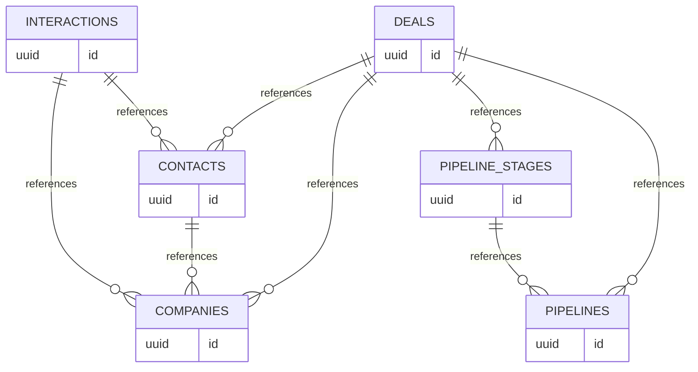

# 📊 Diagrama Entidade-Relacionamento (ER)

```mermaid
erDiagram
    CONTACTS {
        uuid id
    }
    COMPANIES {
        uuid id
    }
    DEALS {
        uuid id
    }
    INTERACTIONS {
        uuid id
    }
    PIPELINES {
        uuid id
    }
    PIPELINE_STAGES {
        uuid id
    }
    DEALS ||--o{ CONTACTS : references
    DEALS ||--o{ COMPANIES : references
    DEALS ||--o{ PIPELINES : references
    DEALS ||--o{ PIPELINE_STAGES : references
    CONTACTS ||--o{ COMPANIES : references
    INTERACTIONS ||--o{ CONTACTS : references
    INTERACTIONS ||--o{ COMPANIES : references
    PIPELINE_STAGES ||--o{ PIPELINES : references
```
